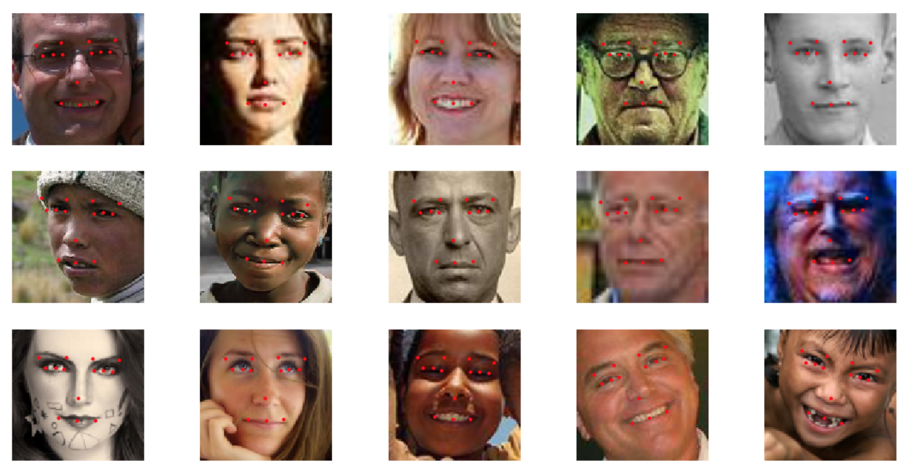

# Welcome

## landmark-detection
Implementation of landmark detection using keras.

Personal project available [here](https://github.com/ErenO/landmark-detection)

# zld-scraper

**Zalando scraper**

Scrap images from zalando and train a classifier on them.

Here are some of them:

**Web app for filters visualisation**

An app to show the image of maximization of the filter's activation.
You just have to choose the layer, then put the filter number, it will automatically save it to static/img/layers_name/

If you put no filter number, it will show you all the filters of the layer. 

Here are some examples : 

All you have to do, is to replace the code of the function make_model() by your model architecture, in visualize.py,
put your model in the folder, and change the model's name in app.py, import also all the necessary dependencies for your model.

To run flask, change the path to app.py in run.sh, 
execute the command:
<pre><code>source run.sh
</code></pre> 
then:
<pre><code>flask run --port 5000 --host 0.0.0.0
</code></pre>

Make sure to export the path to app.py before running the app 
<pre><code>export FLASK_APP='root/your_path'
</code></pre> 

[Link to another page](./another-page.html).
